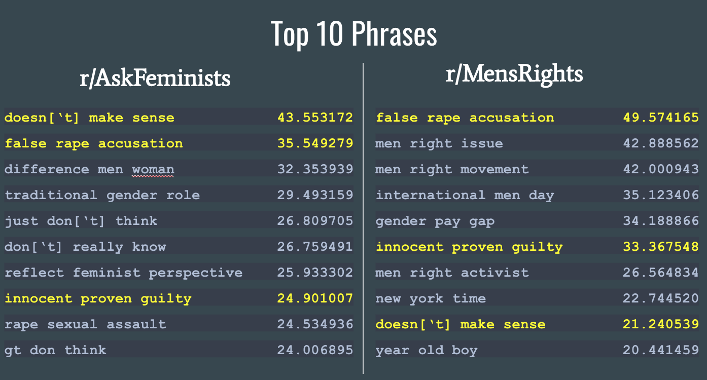
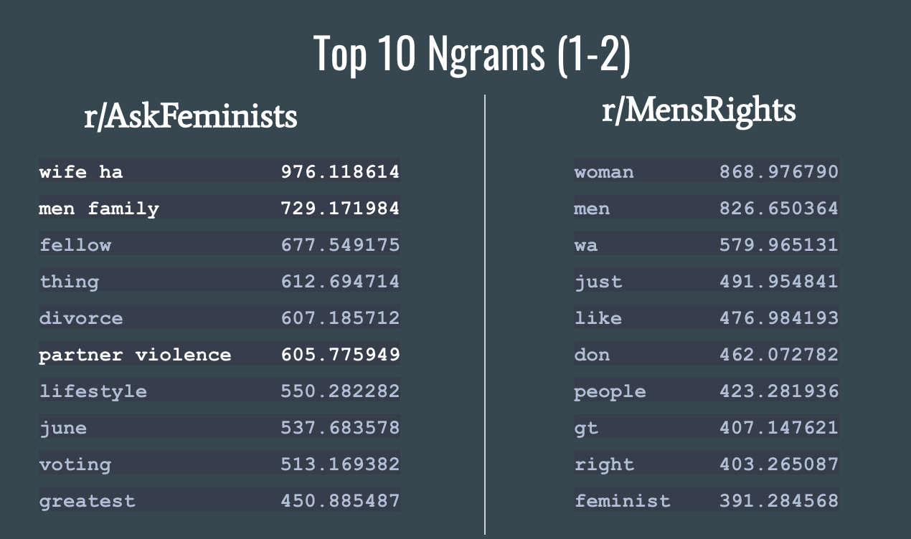
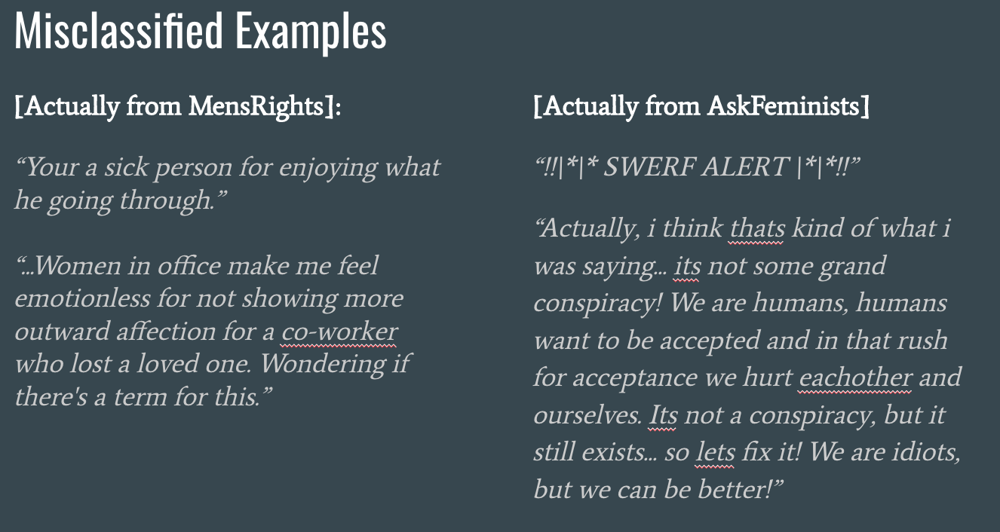
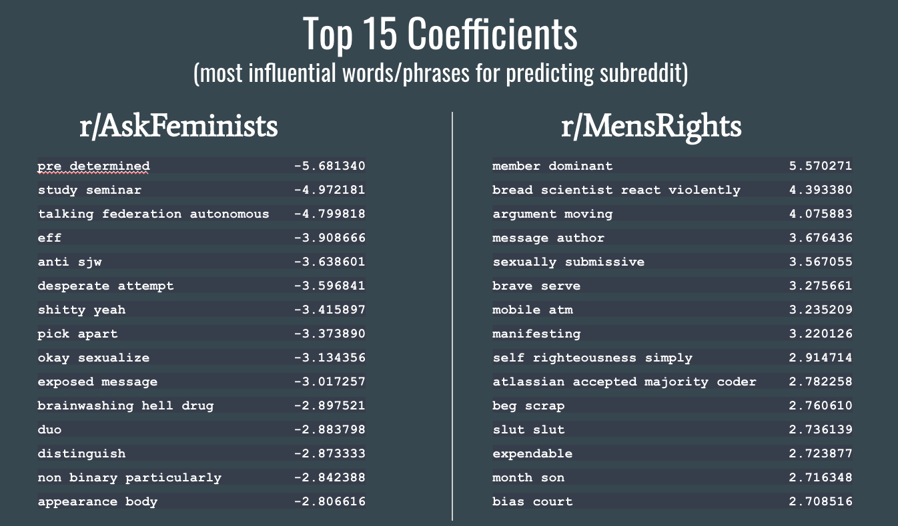

# Can't Live With 'Em: r/AskFeminists vs. r/MensRights
## Executive Summary
 
For this project on natural language processing, we were told to select two subreddits (the more similar, the more challenging) to compare and build a classification model that would predict which subreddit new content was associated with. I thought the most interesting comparison would be between two communities talking about the same or similar topics, but with different attitudes about those topics. I also thought it'd be fun to scrape a controversial subreddit before they got quarantined or banned. So for this project, I decided to compare r/MensRights to r/AskFeminists.

*Background on the Subreddits*

If I'd wanted to compare Mens Rights Activists (MRAs) to Feminists, I could have compared their sub to the r/Feminism rubreddit, which has a more comparable number of subscribers and would probably be a better barometer of what feminists are thinking about/talking about over time. However, the AskFeminists subreddit appealed to me because it focuses more on discussing feminism itself, which I thought would better parallel the types of discussions on the MensRights subreddit (since MRAs spend much more time talking about feminists than feminists spend talking about MRAs). I thought it would be more interesting to examine potentially divergent attitudes/approaches towards feminism and feminist issues, specifically among men or non-feminists who might be using AskFeminists as a forum to ask about or debate feminist issues. (A helpful reference for picking the right feminist subreddit was ['A Feminist's Guide to Reddit' by Suzannah Weiss](https://www.bitchmedia.org/article/feminists-guide-reddit).)

For more context on what these subreddits are about, here's some background on both:

#### [r/AskFeminists](https://www.reddit.com/r/askfeminists)
**About:** “If you've wondered what most feminists think about certain things, what our response is to certain issues, how we think certain things should be handled, or why we have adopted the positions and stands that we have, this is your place to get your questions answered!”

**Subscribers:** 18.6K

**Top All-Time Post:** “What rights, historically denied to women, are you most grateful for today?” (122 upvotes)

#### [r/MensRights](https://www.reddit.com/r/mensrights)
**About:** “The Men's Rights subreddit is a place for those who wish to discuss men's rights and the ways said rights are infringed upon.”

**Subscribers:** 198K

**Top All-Time Post:** “How to get banned from r/Feminism” (30.5K upvotes)

## Problem Statement

> After conducting natural language processing on text from posts and comments over the last year from the subreddits 'AskFeminists' and 'MensRights', how accurately can we predict which subreddit new content belongs to?

## Process
### Web Scraping

For scraping the two subreddits, I used [Pushshift's API](https://github.com/pushshift/api) to access the last years' worth of posts and comments for the two subreddits. In total, I scraped 25,000 comments for each, 4,300 posts for AskFeminists and 6,000 posts for MensRights.  

### Data Cleaning

I kept the AskFeminists and MensRights dataframes separate during the cleaning process. For submissions, I combined 'title' and 'selftext' content into one 'text' column. I created columns to track posts/comments that were removed (by a moderator) or deleted (by a poster). AskFeminists had 1,847 removed posts/comments, about twice as many as MensRights. I removed links, numbers, characters, and references to '[removed]' or '[deleted]' from the text and lemmatized it (keeping stopwords in.) After lemmatizing, I removed contraction leftovers (ex. 'nt', 've') so they wouldn't skew the vectorizer counts.

### Vectorizing

Before combining the two subreddit dataframes into one for modeling, I tested out different vectorizing options on both to compare the two subreddits. I tried out CountVectorizer and TFIDF on the AskFeminists content setting ngrams = (3-5) to get the top phrases from both: TFIDF was less repetitive than the CountVectorizer so I used TFIDF for vectorizing throughout. 

I tried vectorizing on ngrams 3-5, 1-2, and just single words, and created two custom lists of stopwords: one with all English stopwords and words in common between the top 100 words (without stopwords) from each subreddit; the second list of stopwords was created after fitting TFIDF on both subreddits (with stopwords = the first custom list) and taking the common words from the top 100 lists of words for each subreddit again. I tested models with both sets of stopwords and ultimately they didn't improve the model over using stopwords = 'english.')

#### *Interesting Highlights*

**Common Topics of Conversation**

Looking at the top 10 phrases (ngrams = 3-5) from AskFeminists and MensRights, it's interesting to see that they share 3 of the 10 phrases. This indicates to me that similar topics are being discussed on both threads, making it harder to distinguish which subreddit content was made for but also suggesting that these are topics of interest to posters on both threads.

**Tonal and Stylistic Differences**

I was expecting a clearer distinction in the tone between the two subreddits: I assumed MensRights would be more bitter and antagonistic (and that this would come through in the language of the posts), and that AskFeminists would be more neutral given the nature of the subreddits (and their reputations.) The main stylistic differences between the two threads seem to be in the level of focus on the subs: for AskFeminists, bigrams were just as common as single words suggesting more focus within topics, but for MensRights single words were by far more common than bigrams. The emotional charge of the most common words seem to be equal for both threads.

### Modeling

I primarily tested two models on the lemmatized text: Logistic Regression and Random Forest Classifier. Starting with Logistic Regression, I tried several different parameters for vectorizing with TFIDF and the best parameters were 125,000 max features, ngrams = 1-4, and stopwords = 'English'.

The best test score I had ended up being on Logistic Regression (76% accuracy compared to baseline of 50%). This model was overfit on the training data (85% accuracy), and setting lower max_features closed the gap to a 3% difference between training/testing scores but also lowered the test scores. 

The best training score I had was with RandomForestClassifier, n_estimators = 100 and max_depth = 880, which gave me 98% on training data (but just 72% on the test data.)

The Confusion Matrix results from the best Logistic Regression model show a slightly higher rate of misclassifying content as belonging to MensRights (here are the full results, with a 'positive' prediction being for MensRights):

True Negatives: 4317

False Positives: 1474

False Negatives: 1302

True Positives: 4498

#### *Interesting Highlights*

**Human Classification Challenges**

I wanted to look at some of the examples of misclassified content. I found some of them were difficult for me to tell which thread they belonged to, which reinforced the ambiguity in the model classification.

**Most Influential Words/Phrases**

To me, the strongest coefficients for predicting MensRights content were more suprising than the coefficients for AskFeminists, which makes it easy to see why the model may have been slightly worse at classifying content for MensRights.

## Conclusion

It would be too easy to say that my best model's inability to crack 77% accuracy means that "we're really not that different after all", and if I were to spend more time on this project there are other options I would explore to try and improve my model:

1. I'd pull a completely unrelated subreddit to test as a control against the other two subreddits to make sure I was tuning the best model possible.
2. Given how important context is for the comments, I would either try to aggregate comments on a post and analyze them together, or set a minimum wordcount on comments to be used in the analysis to give the model a better chance of distinguishing them.
3. I could scrape another years' worth of data to add to the model.
4. I could do some more cleaning and EDA that might help consolidate slang/similar terms that weren't captured by the lemmatizer, and identify stronger trends in the subreddits that could be leveraged for better prediction.
5. If any of the above helped minimize overfit on the Logistic Regression or Random Forest, I'd give Naive Bayes Multinomial and Support Vector Classifier another shot (and spend more time tuning them).

The **really** interesting questions this project has generated would require a deeper analysis: what's the overlap in people who post on MensRights and AskFeminists? (How many of those are trolls, whose content is removed?) What common themes exist between removed posts (can we write an algorithm for trolling content?) How does sentiment analysis compare across the two subreddits, is there a discernable difference? Is it possible to measure 'extreme' attitudes in a subreddit, and if so can it be mapped over time, against real events happening in the world that might trigger anger on both or one side? Is it possible to follow the posts of single users and see how they change in sentiment and neutrality over time (and does the sub they post on the most make a difference?) Maybe I'll come back to those someday.
